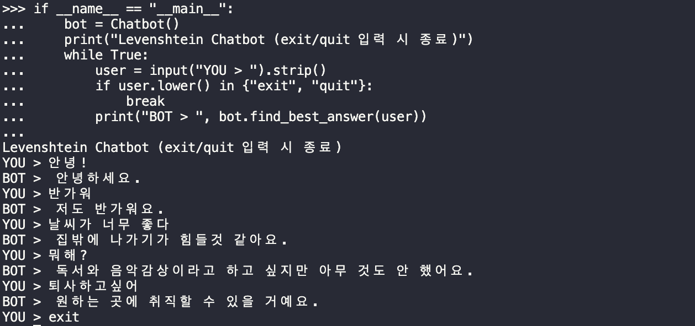

# Chatbot-Levenshtein
### 💡 프로젝트 개요
Chatbot-Levenshtein은 Python으로 구현된 간단한 챗봇 프로젝트로,
사용자의 입력과 학습된 질문 간의 유사도를 레벤슈타인 거리 알고리즘을 활용해 계산하고,
가장 유사한 질문의 답변을 제공합니다.

### 🛠️ 주요기능 및 구현상세
|구분|내용|
|:---:|---|
|레벤슈타인 거리 기반 유사도측정|- 사용자 입력과 학습된 질문 간의 편집 거리를 계산해 가장 유사한 질문을 찾음   - 가장 유사한 질문을 찾기 위해 최소 거리를 가진 질문을 선택함   - 동일한 거리를 가진 질문이 여러개일 경우 질문 길이가 가장 짧은 것을 선택함|
|CLI 인터페이스|- 터미널에서 직접 챗봇과 대화할 수 있는 인터페이스 제공|
|CSV 파일을 통한 학습데이터 관리|- 질문과 답변 데이터를 CSV 파일로 관리해 손쉽게 수정 및 확장 가능|

### 🤖 실행예시

### 📊 학습데이터 셋
- 출처 (https://github.com/songys/Chatbot_data)